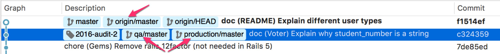

# Muutokset projekteissa

Äänestyspalvelun API ja vaalituloksen laskentapalvelu on auditoitu
syksyllä 2016 Nixun toimesta. Audit on merkitty git historiaan tagilla `X`
(#TODO päivitä taginnimi tähän). Sen lisäksi jokainen tuotantodeploy
saa oman tagin, jolloin git-historiasta voi seurata, mikä kohta
historiaa on deployattu.

Palveluun tehtävät muutokset vertaisarvioidaan vertaamalla edellistä
luotettavaa tilaa uuteen tilaan. Muutokset git-historiasta saa näkyviin
esimerkiksi seuraavasti:

- `git diff --stat FIRST..LAST`
- `git log -p FIRST..LAST`
- Tässä `FIRST` ja `LAST` voivat olla tageja, brancheja tai SHA-tunnisteita.

Tavoite on, että jokaisen deployn jälkeinen tila voidaan kuitata luotettavaksi,
jolloin seuraavan deployn yhteydessä riittää verrata edellisen deploy-tagin
tilaa nykyhetkeen.

## Herokuun deployatun version jäljitys

Kun paikallisessa git-repossa on remotena sekä Github että Heroku, näkee
git-logista, mikä kohta git-historiaa on tällä hetkellä deployattu:
- `git remote add production heroku-url`
- `git fetch -a`
- `git log remotes/production/master`
- tai käytä työkalua kuten `tig`, GitX tai SourceTree.

Esimerkiksi tässä kohdassa Githubin masterissa `origin/master` on uusi commit,
joka ei ole mukana Herokun `qa` tai `production` -ympäristön deployssa:
  
